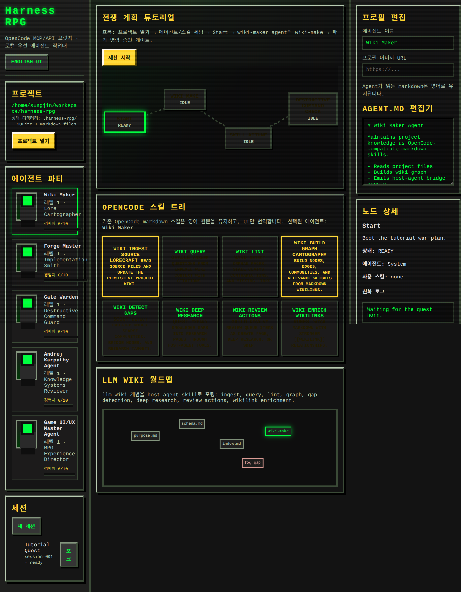

# Harness RPG

Retro pixel RPG prototype for an OpenCode-powered AI agent development workbench.



## Product rationale

Harness RPG is built around two ideas:

1. Make logs, plans, specs, diffs, skill usage, and progress human-friendly through a Rust Tauri desktop shell and rich web UI.
2. Represent jobs as graphs so each node can have one or more assigned agents, skills, logs, artifacts, and result.

See `docs/harness-rpg-product-spec.md` for the full product spec.

## Run

```bash
npm start
```

Open <http://localhost:4173>.

`npm install` is not required for the web prototype runtime; the app uses Node.js built-ins. The only npm package in this repo is the optional Biome dev dependency.

## Use from an existing agent project

From a cloned Harness RPG repo, install a launcher into any existing Claude Code, OpenCode, Copilot, Codex, or other agent workspace:

```bash
bash /path/to/harness-rpg/setup.sh /path/to/agent-project
```

Then run it from that project:

```bash
cd /path/to/agent-project
./.harness-rpg/bin/harness-rpg
```

Do not run `npm start` from the target project unless that project already owns its own npm script. The target project only needs the generated `.harness-rpg/bin/harness-rpg` launcher; the launcher hosts Harness RPG from the cloned repo and points state/artifacts back at the target project.

The launcher serves the Harness RPG UI from the cloned repo, but all exports, graph node markdown, OpenCode artifacts, and `.harness-rpg/state.json` are written inside the target project. Use `PORT=4173` or `OPENCODE_TIMEOUT_MS=60000` before the launcher to override defaults.

## Verify

```bash
npm test
npm run build
```

## Implemented prototype flow

- Open/select the local project workspace.
- View agents as 2-head-tall RPG character cards.
- Edit `Agent.md`-style markdown in the agent inspector.
- Select existing OpenCode-style markdown skills in the RPG skill tree.
- Start the tutorial war-plan graph.
- The graph runs nodes through the local OpenCode bridge when `opencode` is available, falling back to the local simulator if the bridge fails or times out.
- Nodes can be configured with multiple static agents.
- Node details show assigned agents, assigned skills, friendly logs, raw OpenCode bridge events, and artifacts while work is being configured or running.
- The Result tab stores the completed war-plan report, including which skills were actually used and why, after the graph finishes; skill usage can be filtered by node, agent, and skill.
- Destructive command nodes pause behind an approval gate.
- Sessions can be created and forked.
- The LLM Wiki surface visualizes `llm_wiki` concepts as a local-first RPG world map.

The static markdown export remains the source of truth. The dev server can call the local `opencode run` CLI per graph node and records the returned output as bridge events, node logs, artifacts, and Result report evidence. If OpenCode is unavailable, the local simulator path still keeps the prototype usable without provider keys.
